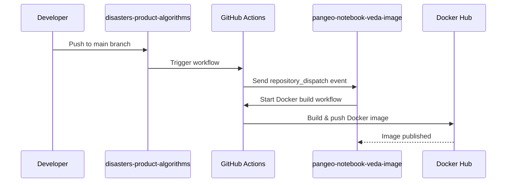

# Docker Rebuild Auto-Trigger Setup

This document explains how to configure automatic Docker image rebuilds when code changes are pushed to this repository.

## Overview

When code is pushed to the `main` branch, a GitHub Actions workflow automatically triggers a rebuild of the `pangeo-notebook-veda-image` Docker image. This ensures the JupyterHub environment always has the latest version of the `disasters-product-algorithms` package.

## Prerequisites

- Admin access to the `Disasters-Learning-Portal/disasters-product-algorithms` repository
- Admin access to the `Disasters-Learning-Portal/pangeo-notebook-veda-image` repository
- GitHub account with permissions to create Personal Access Tokens

## Setup Instructions

### Step 1: Create a GitHub Personal Access Token (PAT)

1. Go to GitHub Settings → Developer settings → Personal access tokens
   - Direct link: https://github.com/settings/tokens

2. Click **"Generate new token (classic)"**

3. Configure the token:
   - **Note:** `Docker Rebuild Trigger for disasters-product-algorithms`
   - **Expiration:** 90 days or No expiration (recommended for automated workflows)
   - **Scopes:** Select `repo` (Full control of private repositories)
     - This includes: `repo:status`, `repo_deployment`, `public_repo`, `repo:invite`, `security_events`

4. Click **"Generate token"**

5. **IMPORTANT:** Copy the token immediately - you won't be able to see it again!

### Step 2: Add Secret to disasters-product-algorithms Repository

1. Navigate to the repository settings:
   - https://github.com/Disasters-Learning-Portal/disasters-product-algorithms/settings/secrets/actions

2. Click **"New repository secret"**

3. Configure the secret:
   - **Name:** `PANGEO_REBUILD_TOKEN`
   - **Value:** Paste the Personal Access Token from Step 1

4. Click **"Add secret"**

### Step 3: Update pangeo-notebook-veda-image Workflow

The `pangeo-notebook-veda-image` repository needs to accept `repository_dispatch` triggers.

1. Navigate to: https://github.com/Disasters-Learning-Portal/pangeo-notebook-veda-image

2. Edit `.github/workflows/build-and-push.yaml`

3. Change the trigger from:
   ```yaml
   on: [push]
   ```

   To:
   ```yaml
   on:
     push:
     repository_dispatch:
       types: [algorithm-updated]
   ```

4. Commit the changes

### Step 4: Test the Integration

1. Make a test commit to the `main` branch of `disasters-product-algorithms`

2. Go to the Actions tab:
   - https://github.com/Disasters-Learning-Portal/disasters-product-algorithms/actions

3. Verify the "Trigger Docker Image Rebuild" workflow runs successfully

4. Check the `pangeo-notebook-veda-image` Actions tab:
   - https://github.com/Disasters-Learning-Portal/pangeo-notebook-veda-image/actions

5. Confirm the Docker build was triggered and completes successfully

## How It Works



### Workflow Details

1. **Push to main** triggers `.github/workflows/trigger-docker-rebuild.yml`
2. **Workflow sends API request** to `pangeo-notebook-veda-image` repository
3. **repository_dispatch event** triggers the Docker build
4. **Docker image is built** with the latest code from GitHub
5. **Image is pushed** to Docker Hub with tags `latest` and commit SHA

### Files Excluded from Triggers

To avoid unnecessary rebuilds, the following file changes do NOT trigger rebuilds:
- Markdown files (`**.md`)
- Documentation (`docs/**`)
- Jupyter notebooks (`notebooks/**`)
- GitHub workflows (`.github/**`)

Only changes to actual source code (`landsat/`, `sentinel/`, `shared_utils/`) trigger rebuilds.

## Troubleshooting

### Workflow fails with "Bad credentials"

**Cause:** The PAT is invalid, expired, or not set correctly

**Solution:**
1. Verify the secret is named exactly `PANGEO_REBUILD_TOKEN`
2. Check the PAT hasn't expired
3. Ensure the PAT has `repo` scope
4. Regenerate the PAT if needed

### No Docker build is triggered

**Cause:** The `pangeo-notebook-veda-image` workflow hasn't been updated

**Solution:**
1. Verify Step 3 was completed
2. Check the workflow file includes `repository_dispatch` trigger
3. Ensure the event type matches: `algorithm-updated`

### Build triggers but fails

**Cause:** Issue in the pangeo-notebook-veda-image build process

**Solution:**
1. Check the build logs in pangeo-notebook-veda-image Actions
2. Verify the `environment.yml` correctly references this repository
3. Check for syntax errors or missing dependencies

## Security Notes

- The PAT has full access to repositories - keep it secure
- Only repository admins can view/edit secrets
- Rotate the PAT periodically for security
- Never commit the PAT to the repository
- Use the minimum required scope (`repo` only)

## Monitoring

### Check Recent Triggers

View workflow runs:
- https://github.com/Disasters-Learning-Portal/disasters-product-algorithms/actions/workflows/trigger-docker-rebuild.yml

### Check Docker Builds

View build history:
- https://github.com/Disasters-Learning-Portal/pangeo-notebook-veda-image/actions

### Check Published Images

View images on Docker Hub:
- https://hub.docker.com/r/[organization]/disasters-jupyterhub-docker-image

## Maintenance

### Token Expiration

If using a token with expiration:
1. Create a new PAT before the old one expires
2. Update the `PANGEO_REBUILD_TOKEN` secret
3. Test the workflow to ensure it works

### Disabling Auto-Rebuild

To temporarily disable automatic rebuilds:
1. Go to repository settings → Actions → General
2. Disable the "Trigger Docker Image Rebuild" workflow
3. Or delete the `.github/workflows/trigger-docker-rebuild.yml` file

## Support

For issues or questions:
- Check workflow run logs for error details
- Review GitHub Actions documentation: https://docs.github.com/en/actions
- Contact the repository maintainers

---

Last updated: January 2025
